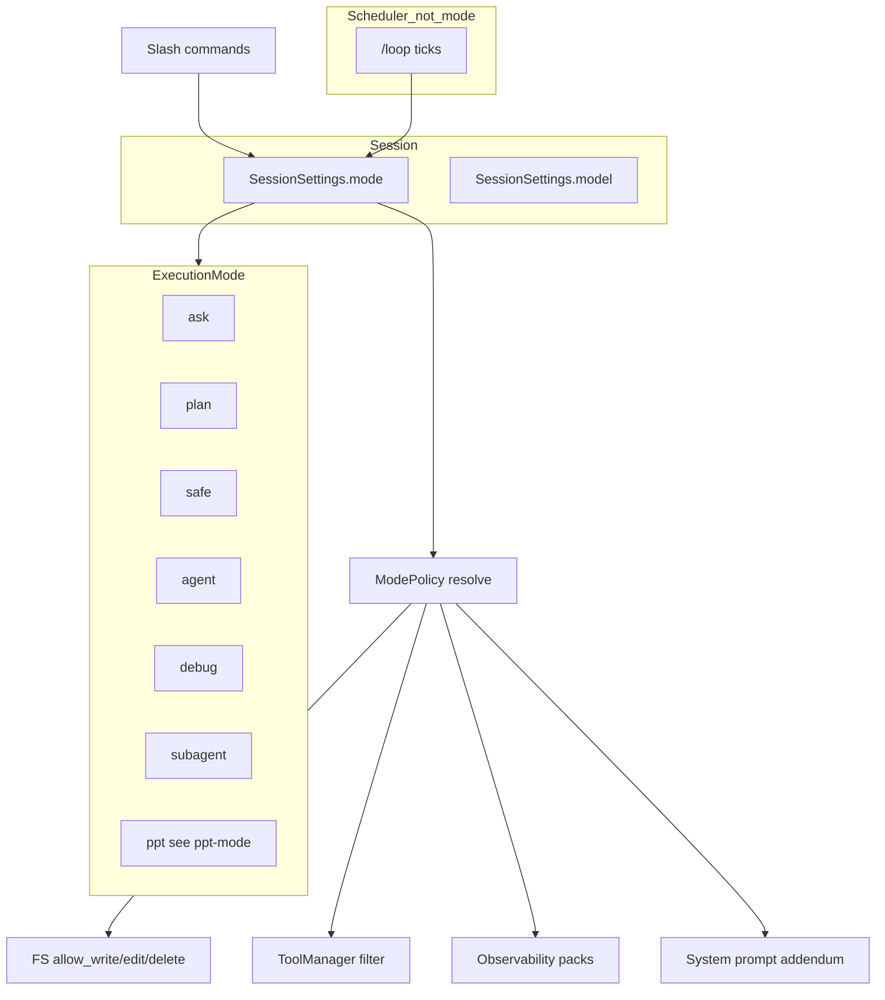
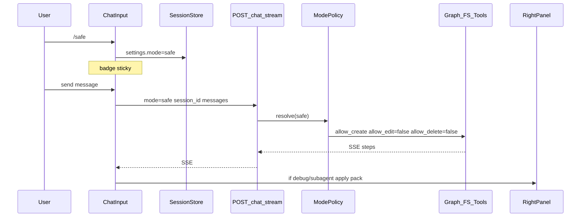

# 设计 — Agent Modes

SoT 行为合同：[methodology.md](./methodology.md)。圆桌过程：[roundtable--modes-ui-demo.md](./roundtable--modes-ui-demo.md)。本文件描述**系统如何拼装**（架构、数据流、模块边界），供实现对照。

## 1. 设计目标

1. 用户用 slash 选择**会话级**策略，粘住直到再切。  
2. 权限与观测分轴：权限档（ask → safe → agent）与观测档（debug / subagent pack）可组合进同一枚举值。  
3. **硬门禁**在 FS + ToolManager；prompt 只辅助。  
4. Loop 是调度器，不是执行权限档。  
5. 寄生 prod：badge / slash / Exec / 右栏面板；不另起暗色壳。

## 2. 概念模型



### 2.1 两轴

| 轴 | 成员 | 作用 |
|----|------|------|
| 权限 | ask / plan / **safe** / agent（及 debug/subagent 的工具面=agent） | 读、新建、改、删、skill、spawn、memory |
| 观测 | 默认 · **Full pack**（debug）· **Subagent pack**（subagent） | 面板强制展开与 SSE 渲染 |

`debug` / `subagent` = **agent 权限面 + 观测强制态**（不是更弱权限）。

### 2.2 枚举（实现）

```text
AgentMode = "ask" | "agent" | "plan" | "safe" | "debug" | "subagent" | "ppt"
# loop 不是 AgentMode；调度 API / 本地 scheduler 单独建模
# ppt 细则 SoT: docs/features/ppt-mode/
```

- UI palette 类型名勿叫 `AgentMode`（已有 `SlashMode`）。  
- `AgentMode.subagent` ≠ SSE `step_type: "subagent"`。  
- `AgentMode.ppt` 的 tools / Deck Preview / `[PPT_STEER]` 见 [ppt-mode/design.md](../ppt-mode/design.md)。

## 3. ModePolicy（建议单模块）

集中解析，避免 `api/main.py` 散落 if：

```text
# 伪代码 — 建议路径 safe_claw/core/agent_modes/policy.py
@dataclass(frozen=True)
class ModePolicy:
    mode: AgentMode
    allow_read: bool
    allow_create: bool
    allow_edit: bool
    allow_delete: bool
    skill_execute: Literal["off", "restrained", "full"]
    memory_auto_write: bool
    spawn: Literal["off", "explore_only", "on", "required"]
    observability: Literal["default", "full", "subagent"]
    system_prompt_addendum: str
```

| mode | create | edit | delete | skill | spawn | observability |
|------|--------|------|--------|-------|-------|---------------|
| ask | ✗ | ✗ | ✗ | off | off | default |
| plan | ✗ | ✗ | ✗ | off | explore_only‡ | default |
| safe | ✓ | ✗ | ✗ | restrained | off | default |
| agent | ✓ | ✓ | ✓* | full | on | default |
| debug | ✓ | ✓ | ✓* | full | on | **full** |
| subagent | ✓ | ✓ | ✓* | full | **required** | **subagent** |

\* 仍受全局 Safety / `allow_delete` 配置。‡ 未接线则 off。

非法 mode → HTTP 400。缺省 / `None` → `agent`。  
`mode=loop` 出现在 `/chat/stream` → **400**（loop 只经调度器发 stream，body 带当时执行 mode）。

## 4. 数据流



Loop：

```text
/loop 5m prompt
  → UI confirm modal (required: done/stop condition, non-empty)
  → Cancel → not armed
  → Arm → Scheduler(session_id, interval, prompt, done_condition)
       on tick → POST /chat/stream { mode: session.mode, prompt+done_condition }
       stop → /loop stop | human | LOOP_DONE
```

完成条件是硬闸门：无确认 / 空条件 → 禁止武装（与 spawn brief 同级 Fail Fast）。

## 5. UI 设计合同

### 5.1 必达

| 元素 | 行为 |
|------|------|
| Slash | `/ask` `/agent` `/plan` `/safe` `/debug` `/subagent` `/loop` |
| Badge | Chat header + composer；反映 `SessionSettings.mode` |
| 策略芯片 | 侧栏或 Exec：至少 create / update / delete 三态；观测 pack 名 |
| Plan artifact | 主区结构块（步骤 / 风险 / 待确认） |
| Loop chrome | Exec 下沿：interval / next / Stop；tick 摘要优先进 Exec |
| Debug | 切入即 Full pack（Exec + Prompt Inspect + Skills 展开等） |
| Subagent | 切入即 Subagent pack；**不**强制 Inspect/Skills |

### 5.2 视觉 SoT

[`demo-modes.html`](./demo-modes.html) — prod 壳 token；harness 标明非产品。落地以 slash+badge 为唯一切换入口。

### 5.3 切换矩阵（观测强制）

| From → To | 观测结果 |
|-----------|----------|
| * → debug | 挂 Full pack |
| * → subagent | 挂 Subagent pack；卸 Full 独有项 |
| debug/subagent → ask/plan/safe/agent | **解除**强制 pack |
| any → loop（调度） | 不改执行 mode；观测随当时执行 mode |

## 6. 后端接线

| 组件 | 职责 |
|------|------|
| `ChatRequest.mode` | 校验枚举；透传构图 |
| Session store API | 持久化 `settings.mode` |
| `ModePolicy` | 上表解析 |
| `FilesystemBackendConfig` | `allow_write` / **`allow_edit`** / `allow_delete`；safe：T/F/F；write 已 create-only |
| `ToolManager` | 按 policy 注册/剥离工具 |
| `official_integration` | prompt addendum；skills 路径不变（skills-activation SoT） |
| Scheduler（新） | loop 武装 / tick / stop |
| UI packs | `right-panel` 面板展开状态受 mode 驱动 |

Safe 与现网对齐：`SecureFilesystemBackend.write` 已对已存在文件失败；`edit` 今日仅查 `allow_write`——**必须**增加 edit 门闩，否则 safe 形同可 update。

## 7. 与相邻主题

| 主题 | 关系 |
|------|------|
| [skills-activation](../skills-activation/) | enabled skills SoT 不变；safe 的 restrained execute 仍只见 enabled 集 |
| [sub-agents](../sub-agents/) | brief 闸门不放宽；`/subagent` 只强制观测 + spawn 必开 |
| Memory | ask/plan/safe：关自动写；agent/debug/subagent：现逻辑 |

## 8. 非目标

- 全局 `agent_config.mode`  
- Streamlit / Cursor 云协议对等  
- `/yolo` `/review` `/explore` 顶层 badge（见 methodology §7）  
- 改 DeepAgents 上游包  

## 9. 开放实现细节（不阻断设计）

1. `allow_edit` 字段名 vs「edit 工具不注册」二选一或双保险——验收以行为为准。  
2. restrained skill：先 FS 门禁兜底；后续可加 skill manifest 危险标注。  
3. Loop 动态间隔算法：Phase D 再定；固定 interval 优先。  
4. 切出 debug 后面板状态：恢复用户偏好 vs 全部折叠——偏好优先，无偏好则默认安静。  
