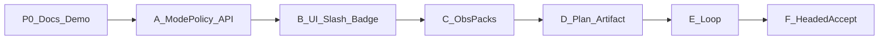

# 计划 — Agent Modes

行为 SoT：[methodology.md](./methodology.md) · 架构 SoT：[design.md](./design.md)

执行 mode：`ask` / `agent` / `plan` / `safe` / `debug` / `subagent`  
调度：`loop`（非执行 mode）

## Phase 0 — 文档 + Demo 合同（进行中）

**目标**：合同与视觉剧本齐套。

**交付**

- [x] methodology / problem / acceptance / e2e / scripts / roundtable  
- [x] [design.md](./design.md) 架构与 ModePolicy  
- [x] Demo 基底（Ask/Agent/Plan/Loop）  
- [ ] Demo 补 **Safe / Debug / Subagent** 并列剧本（策略芯片对照）  
- [x] features README 收录  

**退出**：acceptance §0 文档项可勾；Demo 含全部执行 mode + loop。

---

## Phase A — ModePolicy + API 门禁（P0）

**目标**：请求带 `mode`；权限硬门禁生效。

**交付**

- `safe_claw/core/agent_modes/policy.py`（或等价）：`ModePolicy` + `resolve(mode)`  
- `ChatRequest.mode`：`ask|agent|plan|safe|debug|subagent`；缺省 `agent`；非法 **400**；`loop` **400**  
- Session `settings.mode` 持久化  
- 构图接线：
  - ask/plan → `allow_write=False`，剥 write/edit/delete/execute  
  - **safe** → create-only write；**`allow_edit=False`**；`allow_delete=False`；skill restrained  
  - agent/debug/subagent → 满工具（spawn：subagent=required，其它 on）  
- pytest：`test/api/test_agent_modes.py`（非法 mode、ask 无写、safe 新建✓/覆盖✗/edit✗）  

**退出**：API 合同绿；Safe 行为不被 prompt 单独「保证」。

---

## Phase B — UI slash + badge + 芯片（P0）

**目标**：会话级切换可见、请求同构。

**交付**

- `commands.ts`：全部 slash（含 `/safe` `/debug` `/subagent` `/loop`）  
- `SessionSettings.mode`；header/composer badge；`streamChat({ mode })`  
- New Chat → `agent`  
- 侧栏/Exec 策略芯片：create / update / delete + 当前 pack 名  
- 对齐 Demo（扔 harness 为唯一入口的心智；产品只用 slash）  

**退出**：切换后请求体含 mode；badge 与 session 一致。

---

## Phase C — 观测 pack（P0，可与 B 并行收尾）

**目标**：`/debug` `/subagent` 强制打开合同面。

**交付**

- Debug → Observability Full pack（methodology §5）  
- Subagent → Subagent pack（§5b）；不强制 Inspect/Skills  
- 切出解除强制（design §5.3）  
- 依赖 [sub-agents](../sub-agents/)：子树 SSE/渲染未齐时，本 Phase 至少面板强制展开 + 对已有 execution_step 接线；缺口列入联合验收  

**退出**：acceptance B2/B3 可勾（在 sub-agents 能力范围内）。

---

## Phase D — Plan 产物（P1）

**目标**：Plan 不只是只读 chat。

**交付**

- Plan system prompt addendum（经 ModePolicy）  
- 主区 Plan artifact UI（步骤 / 风险 / 待确认）  
- 无自动转 agent/safe  

**退出**：acceptance C。

---

## Phase E — Loop 调度（P1）

**目标**：`/loop [interval] <prompt>` 可武装 / tick / stop。

**交付**

- Interval 解析；进程内 scheduler（个人自用）  
- Tick → `/chat/stream` 带**当时**执行 `mode`（非 `loop`）  
- Stop；防重复武装  
- UI：Exec 下沿状态；tick 摘要优先进 Exec（防主区洪水）  

**退出**：tick/stop 单测或脚本；E2E 可并入 F。

---

## Phase F — 有头验收（P0）

**交付**

- `test/e2e/agent-modes.spec.ts` 覆盖 [e2e.md](./e2e.md)（S1/S1b/S2/S2b/S2c/S3/S4）  
- acceptance 勾选 + `acceptance-report-YYYY-MM-DD.md`  

**退出**：黄金路径绿（有头可选复验）。

---

## 建议实现顺序（个人自用最短路径）

1. Phase 0 补完 Demo（Safe/Debug/Subagent）— 视觉合同锁死  
2. A（ModePolicy + safe/ask 门禁）— 价值最大  
3. B（slash/badge）— 可操作  
4. C（观测 pack）— 与 sub-agents 进度咬合  
5. D → E → F  

## 非目标（全程）

- Streamlit 对等  
- 全局 `agent_config.mode`  
- Cursor 云协议  
- 修改 DeepAgents 上游  
- 顶层 `/yolo` `/review` `/explore` badge  
