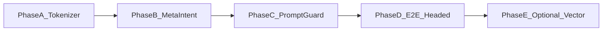

# 开发计划

以 **jargon 中文问句召回** 为驱动，补齐检索 → 注入 → 回答闭环；不推倒重来已落地的四层存储与 API。

## 目标

用户 ingest `obsidian_wiki_investment/wiki/jargon` 后，用自然语言中文问「什么是101 / 你知道哪些黑话」，  
SafeClaw **检索命中 → SSE 真实 chips → 模型回答贴合词条**（非大学导论课）。

## 阶段总览

---

## Phase A — 中文友好分词检索（P0）✅

**Deliver（已完成）**

- `MemoryRetriever.tokenize_query` / `normalize_query`
- 单测 + `verify_jargon_search.sh`：`什么是101` → hits≥1

---

## Phase B — 元问题 / 集合意图（P0）✅

**Deliver（已完成）**

- `is_inventory_query` + manager 拉取 `collection=jargon`
- ingest metadata：`collection=jargon`

---

## Phase C — Prompt 护栏与可观测性（P1）✅

**Deliver（已完成）**

- `format_memory_context` AUTHORITATIVE 护栏
- DeepAgent：caller system（memory）合并进主 system prompt
- SSE memory step 带真实 memories；API 测 `什么是101` stream

---

## Phase D — 有头 E2E + 里程碑门禁（P0 验收）✅

**Deliver（已完成）**

- `test/e2e/memory-jargon-zh.spec.ts`（TC-ZH-01…05）
- scripts ingest / verify
- acceptance 勾选

---

## Phase E — 可选：打开轻量向量（P2）◐

**Deliver（最小可用）**

- `MemoryManager.rebuild_vector_index()`
- ingest：`MEMORY_REBUILD_VECTORS=1` 时重建
- 默认 `enable_vector_search=false`（产品未默认打开）

---

## 已完成基线（勿回退）

以下在本 feature 启动前已完成，重构时保持绿：

| 基线 | 验证 |
|------|------|
| `get_memories_by_layer` + Fail Fast API | `pytest test/api/test_memory.py` |
| Stream 真检索 / 注入 / 阈值写入 | API stream + `deepseek-chat-memory.spec.ts` |
| UI Memory 面板非 stub | `memory-panel.spec.ts` |
| Slash `/remember` `/memory` | `slash-commands` + memory-panel |
| 生命周期 / consolidate / 轻量 embedding 代码 | `test_memory_lifecycle.py` |

## 约束

- Fail Fast：禁止检索失败时静默 `total=0` 且 UI 假装「无记忆系统」
- 单例 `MemoryManager`；存储仅 `WORKSPACE_DIR/memory/`
- 不引入 Chroma；向量仅用现有 hashing + sqlite
- 临时文件写 `~/Downloads/safe_claw_worksapce/workspace/`（若需）
