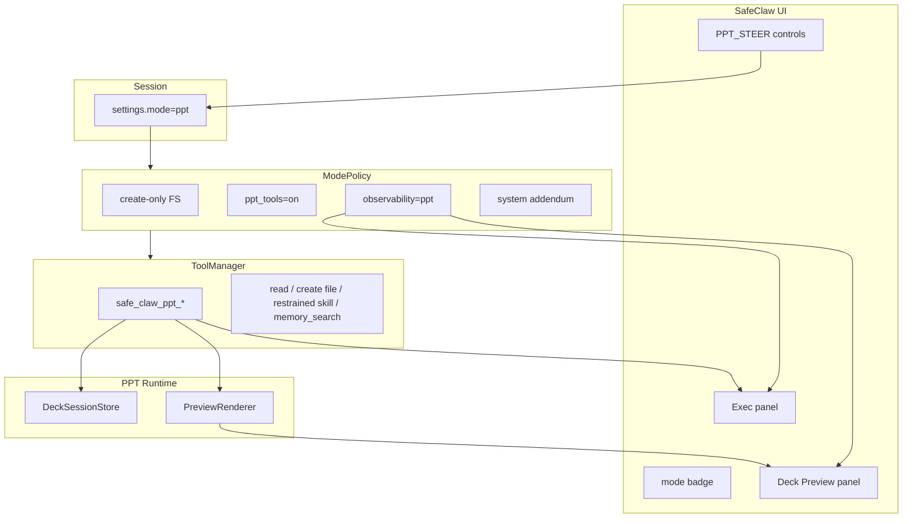
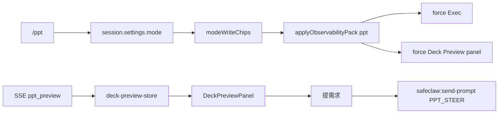

# 设计 — PPT Mode

行为 SoT：[methodology.md](./methodology.md)。父架构：[agent-modes/design.md](../agent-modes/design.md)。  
本文件描述**系统如何拼装**（模块、数据流、事件、存储），供实现对照。

## 1. 设计目标

1. `/ppt` 为会话级执行 mode，权限近 **safe**，观测为专用 **PPT pack**。  
2. **一等 Tools** 是改稿主路径；Skill 可选指引。  
3. 改稿过程在 Exec 可观测；**预览实时**进 Deck Preview。  
4. 用户提需求走短信号，不污染主上下文。  
5. 寄生现有 SafeClaw UI（badge / slash / 右栏）；不另起暗色壳。

## 2. 概念模型



### 2.1 两轴落点（相对 agent-modes）

| 轴 | `/ppt` |
|----|--------|
| 权限 | 同 safe：create ✓ / update ✗ / delete ✗；另 **PPT tools 必开** |
| 观测 | **PPT pack**（Exec + Deck Preview；非 Full / 非 Subagent） |

## 3. ModePolicy 扩展

```text
AgentMode += "ppt"
ObservabilityPack += "ppt"

ModePolicy:
  ...existing fields...
  # ppt_tools: 可由 mode=="ppt" 推导，或显式 bool
```

`resolve_mode_policy("ppt")` 目标态：

| 字段 | 值 |
|------|-----|
| allow_create | True |
| allow_edit / allow_delete | False |
| skill_execute | restrained |
| memory_auto_write | False |
| spawn | off |
| observability | ppt |
| system_prompt_addendum | PPT 工作流（见 methodology §7） |

非法 / 缺省行为继承 agent-modes：缺省 `agent`；`loop` 作 mode → 400。

## 4. PPT Tools 模块

### 4.1 布局

| 模块 | 路径 | 职责 |
|------|------|------|
| 工具实现 | `safe_claw/core/tools/ppt.py` | 纯函数 + `PptToolError`；deck 操作与预览 |
| 会话态 | 同模块或 `ppt_store.py` | `deck_id` → 内存结构；键含 `session_id` |
| 注册 | `safe_claw/core/tools/manager.py` | `mode=="ppt"` 时装载；否则剥离 |
| 导出 | `safe_claw/core/tools/__init__.py` | 按需导出错误类型 |

### 4.2 Deck 会话态（逻辑模型）

```text
DeckState:
  deck_id: str
  title: str
  theme_id: str
  slides: list[SlideState]   # index 0-based 内部；对外 slide=N 为 1-based
  current_version: int | None  # 最近一次成功 save 的 N
  dirty: bool                  # 自上次 save 后是否有变更

SlideState:
  title: str
  bullets: list[str]
  notes: str
  layout: str
  images: list[ImageRef]       # workspace-relative
```

- `slide_remove` / `reorder` / `upsert` 只改 `DeckState`，置 `dirty=True`。  
- `save_version`：序列化 → `WORKSPACE_DIR/ppt/{deck_id}_v{N}.pptx`，N = max(existing)+1；成功后 `current_version=N`，`dirty=False`。  
- `preview`：要求存在已保存版本（若 dirty，合同：**Fail Fast 要求先 save**，或工具内自动 save 新版本——实现须在 acceptance 勾选一种并测死；**推荐：要求显式 save，禁止隐式**）。

### 4.3 预览渲染

```text
PreviewRenderer.probe() -> engine_name | raise PptToolError
PreviewRenderer.render(pptx_path, out_dir) -> list[png_path]
```

- 探测顺序（示例）：Spire → Aspose →（可选）其它；全部失败 → 明确错误（缺包名 + 安装提示）。  
- 禁止返回空列表却标记 success。

### 4.4 路径安全

- 所有读写限制在 `WORKSPACE_DIR / "ppt"` 下（resolve + `relative_to` 校验）。  
- `image_place` 源图须在 `WORKSPACE_DIR` 内。  
- Preview HTTP 同前缀校验。

## 5. API / SSE

### 5.1 Chat

现有 `POST /chat/stream`：`ChatRequest.mode` 接受 `ppt`；构图时 `resolve_mode_policy` + ToolManager 过滤。

### 5.2 预览事件（推荐）

SSE 事件类型 `ppt_preview`（或 `execution_step` 扩展 payload）：

```json
{
  "type": "ppt_preview",
  "deck_id": "q3-review",
  "version": 2,
  "pptx_path": "ppt/q3-review_v2.pptx",
  "slide_count": 8,
  "preview_urls": [
    "/workspace-files/ppt/previews/q3-review_v2/slide_01.png",
    "..."
  ]
}
```

由 `safe_claw_ppt_preview` 成功路径触发（official_integration / api 层挂钩）。

### 5.3 静态预览

`GET` 受控文件路由（名称可调整）：仅映射 `WORKSPACE_DIR` 下相对路径；越界 400。

## 6. 前端架构



### 6.1 模块触点

| 触点 | 行为 |
|------|------|
| `entities/agent-mode.ts` | `AgentMode` + chips + observability `ppt` |
| `slash/commands.ts` | `/ppt` + `MODE_SLASH_IDS` |
| `ui-store.ts` | `applyObservabilityPack("ppt")`：Exec 开、Deck Preview 开；不钉死 Inspect/Skills |
| 新 `deck-preview-store` / panel | 当前 deck/version、选中页、版本列表、加载/错误 |
| Exec | `safe_claw_ppt_*` 步骤可读摘要（tool 名 + 关键参数） |
| Outline artifact | 解析 `### Deck Outline`；CTA：确认出稿 / 改大纲 |

### 6.2 提需求注入格式

```text
[PPT_STEER] slide=3
deck_id: q3-review
version: 2
需求：标题改成「风险与应对」，减少子弹
```

全局：

```text
[PPT_STEER] scope=deck
deck_id: q3-review
version: 2
需求：整体换成深色商务风，留白更大
```

## 7. Skill（辅助）

`skills/private_skills/pptx-authoring/SKILL.md`：

- 何时调哪个 `safe_claw_ppt_*`  
- 中文排版 / 一页一意 / 少贴整页截图  
- **不**提供「绕过 tools 的一键黑盒 build」作为推荐主路径  

须经 [skills-activation](../skills-activation/) 启用才进入 loaded list；mode **不**绕过 SoT。

## 8. 与 agent-modes / sub-agents 边界

| 主题 | 关系 |
|------|------|
| agent-modes | 枚举、slash、ModePolicy、pack 机制的宿主；本 feature 扩展 `ppt` |
| sub-agents | 复用「短 steer 信号 + Exec Halt」产品模式；`/ppt` **关闭 spawn** |
| skills-activation | skill 可选；tools 不依赖 skill 开关 |

## 9. 测试分层

| 层 | 内容 |
|----|------|
| 单元 | `ppt.py` 各 tool；路径越界；save 不覆盖；preview 缺引擎 |
| ModePolicy | `ppt` resolve；非 ppt 工具列表无 `safe_claw_ppt_*` |
| API | `mode=ppt` 200 构图；非法 mode 400 |
| Playwright | `/ppt` badge + Deck Preview 强制可见；steer 含 `PPT_STEER` |

## 10. 非目标（设计层）

- 浏览器 WYSIWYG PPT 编辑器  
- 多用户 deck 锁 / 分布式 store（个人自用进程内即可）  
- 默认打开无关 skills  
