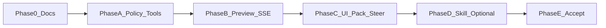

# 计划 — PPT Mode

行为 SoT：[methodology.md](./methodology.md) · 架构 SoT：[design.md](./design.md) · 验收：[acceptance.md](./acceptance.md)

## Phase 0 — 文档合同（本阶段 · 进行中）

**目标**：设计 / 计划 / 验收 / 方法论齐套，实现有据可依。

**交付**

- [x] [README.md](./README.md)  
- [x] [methodology.md](./methodology.md)  
- [x] [design.md](./design.md)  
- [x] [plan.md](./plan.md)（本文件）  
- [x] [acceptance.md](./acceptance.md)  
- [x] [problem.md](./problem.md)  
- [x] [e2e.md](./e2e.md) / [scripts.md](./scripts.md)  
- [x] [docs/features/README.md](../README.md) 收录 `ppt-mode`  
- [x] [agent-modes](../agent-modes/) methodology / design 交叉引用 `ppt`  

**退出**：acceptance §0 已勾；实现不得早于合同冲突未解决。

---

## Phase A — ModePolicy + 一等 PPT Tools（P0）

**目标**：`mode=ppt` 合法；**仅 ppt** 注册完整 MVP tool 面；FS create-only。

**交付**

- `policy.py`：`AgentMode` / `EXECUTION_MODES` / `ObservabilityPack` 含 `ppt`；`resolve_mode_policy`  
- `safe_claw/core/tools/ppt.py`：methodology §5 全部 MVP tools + `PptToolError` + DeckSessionStore  
- `ToolManager`：`mode=="ppt"` 注册；其它 mode 剥离  
- `save_version` 永不覆盖；路径限 `WORKSPACE_DIR/ppt`  
- pytest：policy、tool 快乐路径、越界、非 ppt 无工具  

**退出**：acceptance A / T 可自动化勾选（预览可先 mock 引擎接口）。

---

## Phase B — Preview 管线 + SSE / 文件 API（P0）

**目标**：`safe_claw_ppt_preview` 真渲染；UI 可拉到 PNG。

**交付**

- `PreviewRenderer` 探测 Spire/Aspose（或已装引擎）；缺依赖 Fail Fast  
- SSE `ppt_preview`（或等价 step payload）  
- 受控 `GET` 预览文件（workspace 前缀）  
- 单测：缺引擎报错；越界 URL 拒绝  

**退出**：acceptance P 核心项可勾。

---

## Phase C — UI pack + Deck Preview + 提需求（P0）

**目标**：切入 `/ppt` 即强制观测面；用户能对着预览提需求。

**交付**

- 前端 `AgentMode` / slash `/ppt` / chips（同 safe）  
- `applyObservabilityPack("ppt")`：Exec + Deck Preview  
- `DeckPreviewPanel`：缩略图、大图、版本列表、加载/错误  
- 订阅 SSE → 自动刷新  
- 页级 / 全局提需求 → `[PPT_STEER]` stream  
- Outline artifact CTA（确认出稿 / 改大纲）— 可与 pack 同 PR 或紧随  

**退出**：acceptance U / S 可勾；Playwright 烟雾绿。

---

## Phase D — 可选 Skill（P1）

**目标**：风格与调用菜谱；不替代 tools。

**交付**

- `skills/private_skills/pptx-authoring/SKILL.md`  
- 文档声明：skills-activation SoT；缺 skill 验收路径仍过  

**退出**：acceptance K。

---

## Phase E — 有头 / 自动化验收（P0）

**交付**

- pytest 全绿；Playwright [e2e.md](./e2e.md) S0–S3  
- `acceptance-report-YYYY-MM-DD.md` + 必要时 evidence  
- agent-modes 交叉核对更新  

**退出**：acceptance 人工可关闭的项勾完（预览引擎环境依赖写明）。

---

## 建议实现顺序

1. Phase 0 收尾（features README + agent-modes 交叉引用）  
2. A（policy + tools）— 价值骨架  
3. B（preview + SSE）— 可观测闭环  
4. C（UI + steer）— 提需求闭环  
5. D → E  

## 非目标（全程）

- 浏览器内嵌完整编辑器  
- 非 ppt mode 暴露 PPT tools  
- Skill 黑盒替代 tools  
- Streamlit 对等；改 DeepAgents 上游  
