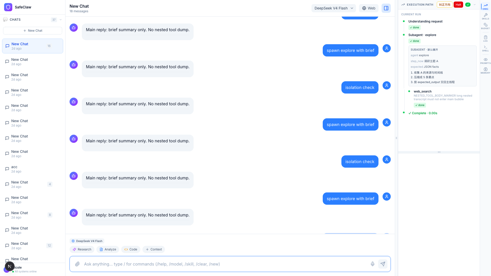
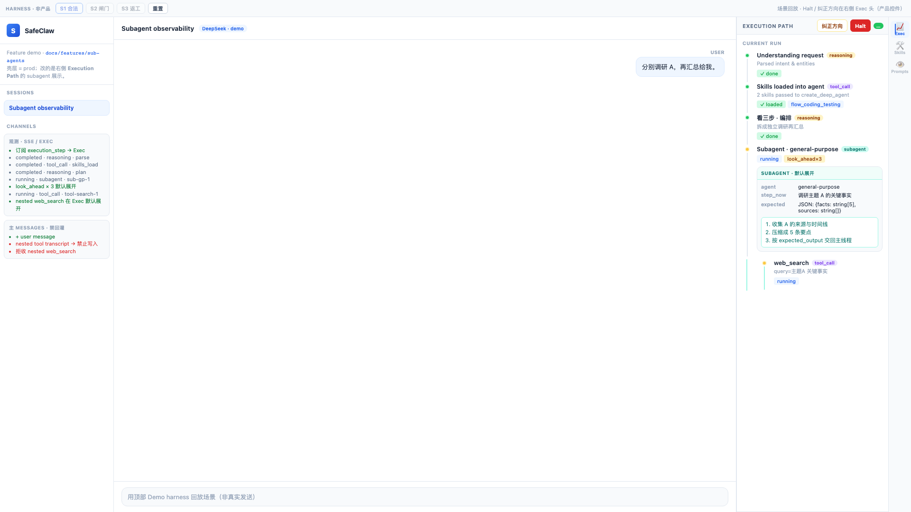
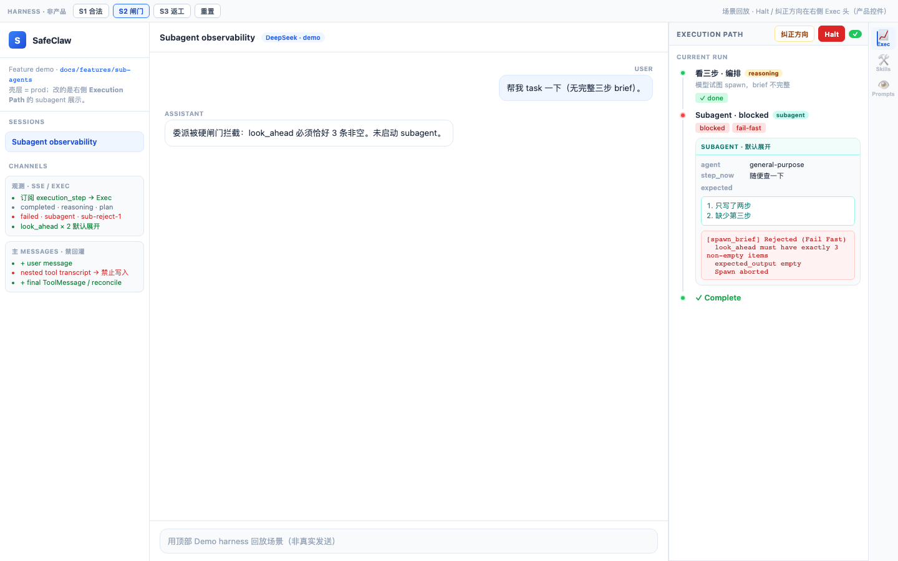
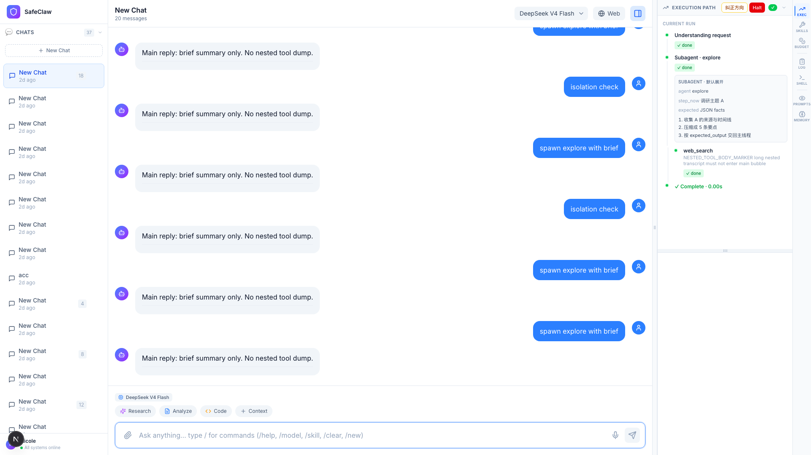

# Sub-agents — 验收 Evidence Pack（2026-08-03）

机器可复验产物：截图 + 日志 + DOM JSON。对应 [acceptance.md](../acceptance.md) / [e2e.md](../e2e.md)。

**Verdict：本期 A–D2 / F 自动化 PASS；E / 部分 D·G 未验收。**

## 复跑命令

```bash
export NO_PROXY='*' FRONTEND_URL=http://127.0.0.1:3000
# API :8000 + UI :3000 需已启动

PYTHONPATH=. pytest \
  test/deepagents/test_spawn_brief.py \
  test/api/test_subagent_sse.py::test_spawn_brief_gate_emits_failed_shape \
  test/api/test_subagent_sse.py::test_parse_task_args_json_brief_roundtrip \
  -v

cd test/e2e && npx playwright test sub-agents.spec.ts --retries=0
```

本次归档时间见 [RUN_AT.txt](./RUN_AT.txt)。

## 目录

| 路径 | 内容 |
|------|------|
| [screenshots/](./screenshots/) | S1 / S1b / S2 / S3 全页截图 |
| [logs/pytest-spawn-brief-sse.txt](./logs/pytest-spawn-brief-sse.txt) | 硬闸门 pytest 原文 |
| [logs/playwright-sub-agents.txt](./logs/playwright-sub-agents.txt) | Playwright S1/S1b/S3 原文 |
| [logs/spawn-brief-gate-cases.json](./logs/spawn-brief-gate-cases.json) | 闸门用例机读结果 |
| [logs/s1-react-dom.json](./logs/s1-react-dom.json) | React Exec DOM 断言快照 |
| [logs/s1b-demo-dom.json](./logs/s1b-demo-dom.json) | Demo S1 DOM 合同 |
| [logs/s2-gate-dom.json](./logs/s2-gate-dom.json) | Demo S2 闸门失败 DOM |

## Acceptance → Evidence 映射

| ID | 标准 | Evidence |
|----|------|----------|
| A | 硬闸门拒 spawn | `spawn-brief-gate-cases.json`：`look_ahead_2` / `empty_expected` / `unknown_agent` → `ok:false`；pytest 10 passed |
| A | 错误含字段名 | 同上 JSON `error` 字段含 `look_ahead` / `expected_output` / `whitelist` |
| B | SSE subagent + look_ahead | S1 mock SSE → React DOM；`s1-react-dom.json` |
| B | nested `parent_step_id` | Exec 树：`exec-step-nested-tool` under subagent；见 S1 截图 |
| B | done 无 `skill_names` | 代码路径 `api/main.py` + 既有 contract；本期证据以闸门/观测为主 |
| C | look_ahead×3 默认展开 | `s1-react-dom.json`：`lookAheadCount: 3`；[screenshots/sub-agents-s1.png](./screenshots/sub-agents-s1.png) |
| C | nested tool 默认展开 | `nestedTool: true`；同截图 `web_search` |
| C | 闸门失败可见 | [screenshots/sub-agents-s2-gate-demo.png](./screenshots/sub-agents-s2-gate-demo.png) + `s2-gate-dom.json` err |
| D | 主气泡不污染 | `s1-react-dom.json`：`mainContainsMarker: false`，`nestedContainsMarker: true` |
| D2 | Halt / 纠正方向在 Exec 头 | `halt`/`steer` true；S1/S1b 截图面板头 |
| F | E2E S1–S3 | `playwright-sub-agents.txt`：**3 passed** |

## 截图索引

### S1 — React Exec（mock SSE）



可读点：`Subagent · 默认展开`、三条前瞻、`web_search` 含 `NESTED_TOOL_BODY_MARKER`、主气泡仅 “Main reply: brief summary only…”、Exec 头 **纠正方向 / Halt**。

### S1b — Demo HTML 合同



prod 壳 + Exec 嵌套；左侧 harness 观测通道示意。

### S2 — 硬闸门失败（Demo）



`blocked` / `fail-fast`；err-box：`look_ahead must have exactly 3` + `Spawn aborted`。

### S3 — 隔离



marker 仅在 Exec nested tool；主气泡无 marker。

## 未纳入本期 evidence

| 项 | 原因 |
|----|------|
| E Skill fork 真执行 | Phase C |
| 真 LLM 有头 spawn | 本包用 mock SSE / Demo；可选人工 headed 复验 |
| skills-activation 回归 | 未在本包重跑 |

## 人类可选复验

- [ ] `HEADED=1 FRONTEND_URL=http://127.0.0.1:3000 npx playwright test sub-agents.spec.ts --retries=0`
- [ ] `open docs/features/sub-agents/demo-observability.html` → S1 / S2 / S3 / Halt / 纠正方向
