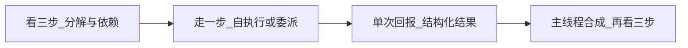
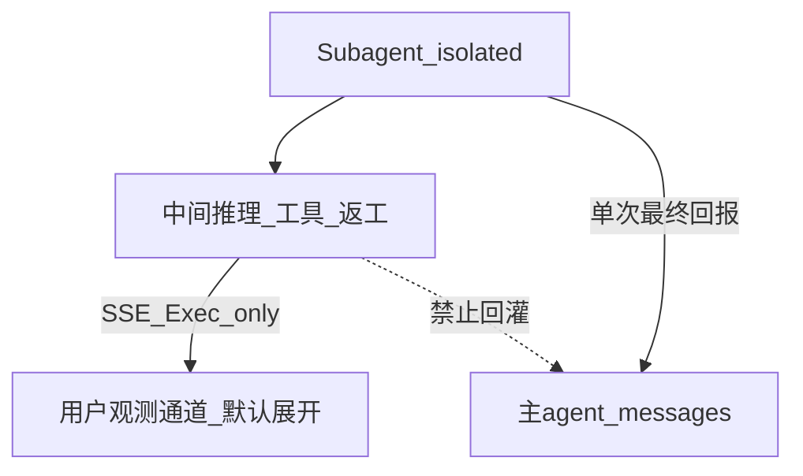

# 方法论 — 走一步看三步

本文件是 Feature `sub-agents` 的 **SoT**。实现与验收以本文硬规则为准。

## 定义

主 agent 在委派或自执行前，必须完成「**当前一步 + 前瞻三步**」；subagent 只承接其中**可隔离、可一次回报**的一段，而不是替主线程盲走。

| 角色 | 走一步 | 看三步 |
|------|--------|--------|
| 主 agent（编排） | 决定：自做 / `task` 委派 / 并行多个 subagent | 拆目标、标依赖、定每段预期产出与退出条件 |
| Subagent（执行） | 在隔离上下文中自主跑完被委派的那一段 | brief 内可预见工具链与失败面，但**只回报最终结果** |
| UI / SSE（观测通道） | 当前 running + **默认展开**子工具/中间推理 | 前瞻三步 + 返工轨迹对用户可见 |
| 主 agent messages（推理通道） | 只吃 `task` 的**最终 ToolMessage 回报** | **禁止**把子代理中间步/纠错 transcript 写回主上下文 |

## 双通道隔离

观测与推理分离，同等硬约束：

- **观测通道**：SSE `execution_step`、Exec 面板、sub 侧 PromptInspect — 可完整展示中间步。  
- **推理通道**：主 agent `messages` / 下一轮 LLM prompt — **仅** brief 调用意图 + 最终回报（及必要时极短摘要）。  
- **不得**因为「要给用户看」就把 nested transcript 拼进主 conversation state。

## Spawn brief 硬闸门（防冒进）

**强制机器合同，不是 prompt 软提醒。** 缺字段 = 禁止 spawn。

| 字段 | 约束 |
|------|------|
| `step_now` | 非空 str — 当前一步 |
| `look_ahead` | 恰好 **3** 条非空 str |
| `expected_output` | 非空 str — 回报格式 / 验收点 |
| `agent_name` | 白名单内（起步：`general-purpose`，可选 `explore`） |

- **闸门位置**：SafeClaw 包装层（`task` / skill fork）先 `validate_spawn_brief`，再调用底层 subagent。  
- **失败语义**：不调用子代理；SSE `step_type: subagent`、`status: failed`，原因列出缺字段。  
- **Prompt 角色**：只教模型如何填对 brief，**不是**唯一防线。  
- 允许短句；禁止空话 / 「你看着办」。不强迫凡事委派（琐事主线程直做）。

## 返工与纠正

1. 子代理内部试错、工具失败重试、自我纠正 — **留在子上下文**；用户可在 Exec **默认展开**看到。  
2. 若最终回报不合格：主 agent **再看三步 → 重新 spawn**（新 ephemeral + 新 brief）。  
3. **禁止**把旧子代理失败轨迹塞进主 `messages` 继续「多轮子会话」。  
4. Subagent = 派工单 + 闭环，不是可挂起的共享上下文同事。

## 用户可见性（个人自用）

| 内容 | 默认 UI |
|------|---------|
| `look_ahead` ①②③ + `step_now` + `expected_output` | Exec **默认展开** |
| Nested tool / 中间推理 | Exec **默认展开**（可手动折叠） |
| 主 chat 气泡 | 不强制刷中间步；权威面 = 右侧 Exec |

缺展示 = 验收不过（见 [acceptance.md](./acceptance.md)）。

## 与 DeepAgents 对照

| DeepAgents / 常见实践 | SafeClaw 落点 |
|----------------------|---------------|
| `task` ephemeral + 单次回报 | 推理通道只吃 Return |
| When NOT to use task（琐事） | 不强迫委派；一旦委派必须过闸门 |
| 中间步对主线程隐藏 | 观测通道补齐并默认展开；**不**回灌主上下文 |
| `subagents=` 自定义类型 | Phase C；skills 过滤复用 [skills-activation](../skills-activation/) SoT |
| Skill `context: fork` | 与 `task` 共用 brief 闸门与 SSE 合同 |

## Stop the World（用户急停）

个人自用场景下，必须能 **一键冻结** 主 agent 与全部 subagent：

- 停止继续 spawn / 工具 / reconcile  
- **保留** Exec 观测现场（`running` → `cancelled`），便于检查  
- 观测通道可记一条 halt 事件；主上下文不再追加  
- Demo：`demo-observability.html` 的 **STOP THE WORLD**（`Esc`）  

实现期对应 API/UI 急停合同（本期文档 + Demo 先立；接线见 plan）。

## 纠正方向（User Steer / Redirect）

一键纠正 **当前 subagent 方向**，并 **提示 main agent 换个方向**：

1. 取消进行中的 subagent（观测态 `redirected`，现场可检）  
2. 向主通道注入 **短控制信号**（允许进主上下文），例如：  
   `[USER_STEER] 要换个方向。新方向：…；重新看三步后 spawn；勿合并旧子轨迹。`  
3. **禁止**把被取消 subagent 的中间 transcript 回灌主上下文  
4. Main 应 acknowledge → 再看三步 → **新 ephemeral spawn**（新 brief）  

与「返工」区别：返工可由 main 自主判断；纠正方向是 **用户主动打断并换向**。  
Demo：`纠正方向` 按钮（快捷键 `R`）。

## 明确不做（方法论层）

- 把 subagent 做成与主线程共享 message 列表的长会话  
- 仅靠 system prompt「请记得看三步」而无校验  
- 为可观测而污染主上下文  
