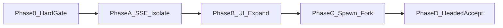

# 计划 — Sub Agents

方法论 SoT：[methodology.md](./methodology.md)。

## Phase 0 — 硬机器合同（P0）

**目标**：「看三步」运行时强制；文档写清双通道隔离。

**交付**

- [methodology.md](./methodology.md) 定稿（硬闸门 + 观测≠回灌 + 返工=再 spawn）  
- `safe_claw/core/deepagents/spawn_brief.py`：`validate_spawn_brief` Fail Fast  
- 包装 `task` / fork：先 validate 再 spawn  
- System prompt：填表说明 +「不合格则重新委派」  
- 白名单：`general-purpose`（+ 可选 `explore`）  

**退出**：brief 校验单测（缺字段不 spawn）；文档与 acceptance 勾选硬闸门 + 隔离。

## Phase A — SSE + 后端埋点 + 隔离（P0）

**目标**：`task` 形成可关联子树；中间步只进观测通道。

**事件合同**（扩展 `execution_step`）：

- `step_type: "subagent"` — running / completed / failed  
- 字段：`step_id`, `parent_step_id`, `agent_name`, `step_now`, `look_ahead`[3], `expected_output`, `status`, `duration`, `chips`  
- 校验失败也发 failed step（缺字段列表）  
- 子工具：`step_type: "tool_call"` + `parent_step_id`  
- 扁平 `type: tool` 可兼容；**权威树**走 `execution_step`  

**交付**

- `official_integration.py` `stream()`：观测用结构化事件；不二次回灌主 messages  
- `api/main.py`：透传；修 `done` 未定义 `skill_names`  
- Sub PromptLogger 按 parent 挂观测 API  
- pytest：SSE 父子完整 + **主 messages 无 nested 中间内容**  

**退出**：观测链路完整 + 隔离断言绿。

## Phase B — 前端默认展开（P0）

**目标**：在 **现有 prod Exec 面板**上重构 subagent 展示（非另起皮肤）；默认展开前瞻 + 中间工具/推理；数据不回写主 message 文本。

**视觉合同**：[`demo-observability.html`](./demo-observability.html)（prod shell + Exec 嵌套）。

**交付**

- `ExecutionStepType` 增加 `subagent`；`lookAhead` / `stepNow` / `expectedOutput`  
- `chat-api` / `execution-store` 接线（含 failed / redirected / cancelled）  
- [`right-panel.tsx`](../../../safeclaw-ui/my-app/src/components/right-panel.tsx) `ExecutionPathPanel`：嵌套 parent/children、sub-block 前瞻、默认展开  
- Stop the World / 纠正方向控件进 prod UI（位置对齐 demo harness → 最终进 Exec/header）  

**退出**：注入/真 SSE 后 DOM 可见三步 + nested；主气泡无完整子 transcript；观感与 demo 一致。

## Phase C — 自定义 subagent + Skill fork（P1）

**目标**：真委派，不只观测默认 `task`。

**交付**

- `create_deep_agent(..., subagents=[...])`；skills/tools 复用 skills-activation SoT  
- `executor.py` fork 真 spawn；共用 `validate_spawn_brief`  
- `ToolManager` 特判 `type == "subagent"`，禁止空壳 success  
- 不合格 → 重新 spawn，不合并失败轨迹进主上下文  

**退出**：demo fork 跑通；缺三步拦截；discover 无空成功。

## Phase D — 有头验收（P0）

**交付**

- `test/e2e/sub-agents.spec.ts`（或等价）覆盖 [e2e.md](./e2e.md)  
- [acceptance.md](./acceptance.md) 勾选 + acceptance-report  
- 更新 README 能力矩阵  

**退出**：人工 — 硬闸门可见、Exec 默认展开、主上下文不被污染。

## 非目标（本期）

- Cursor IDE 式全类型全家桶  
- Streamlit UI 对等改造  
- 改 DeepAgents 上游包  
- `look_ahead` 长篇散文（短句即可）  
- Subagent 与主线程共享 message 列表的长会话  
