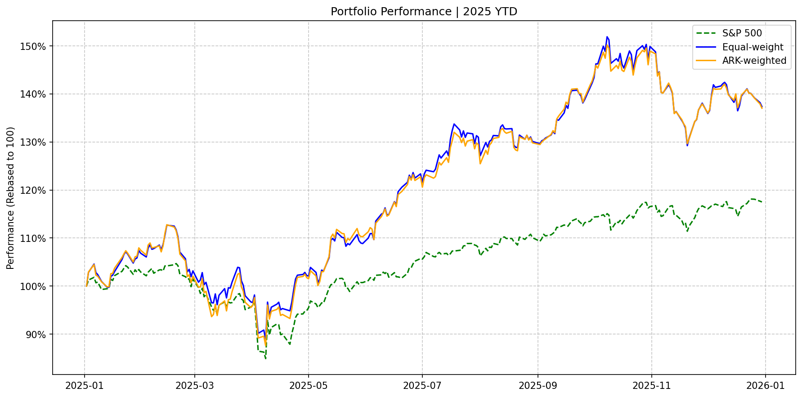
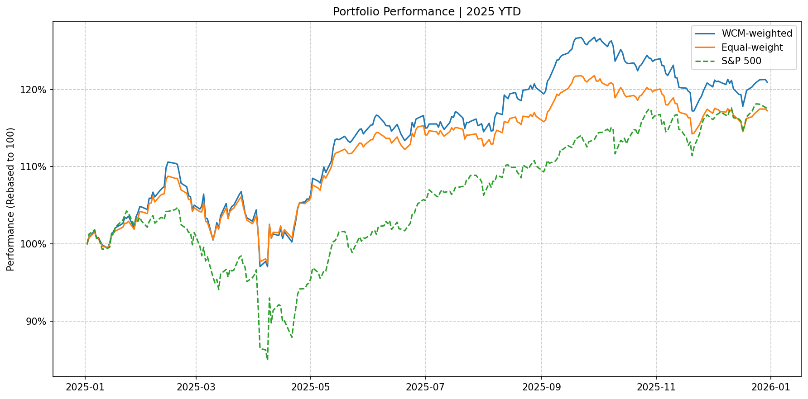
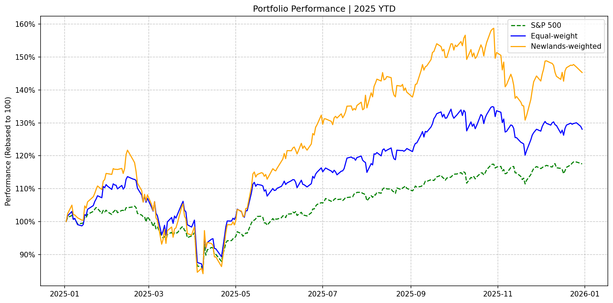
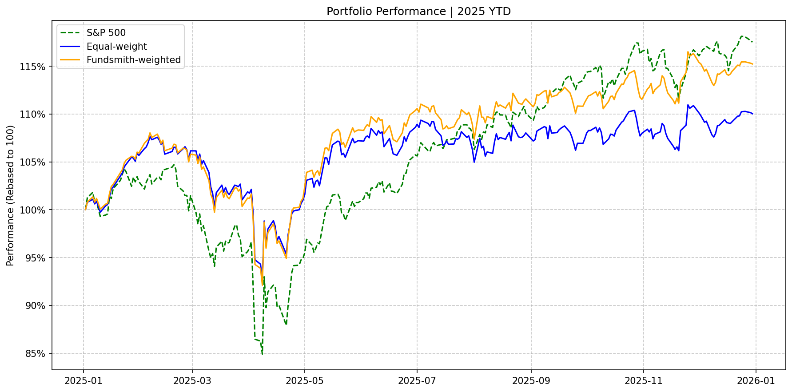
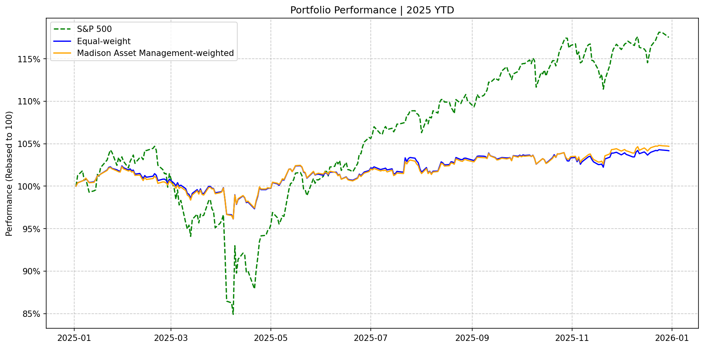
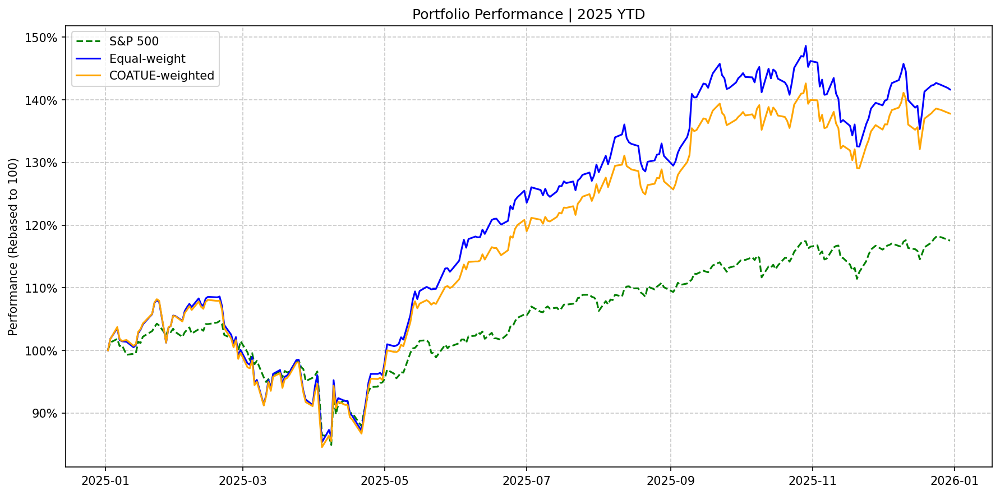
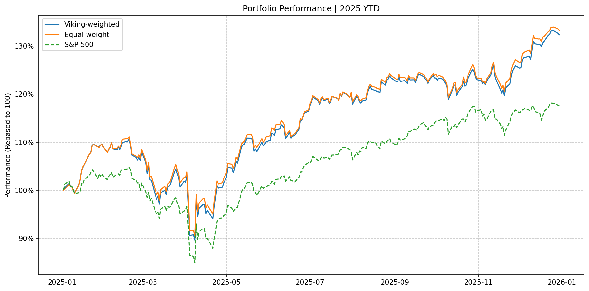
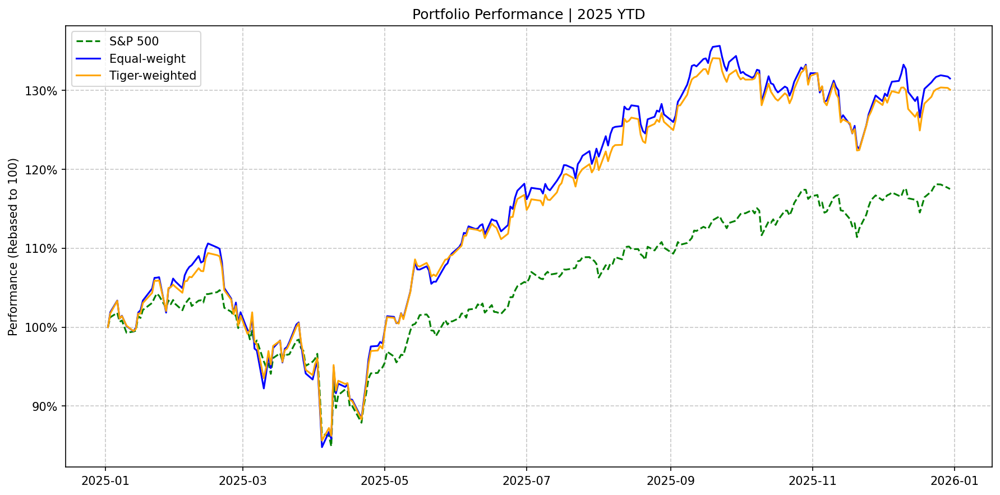
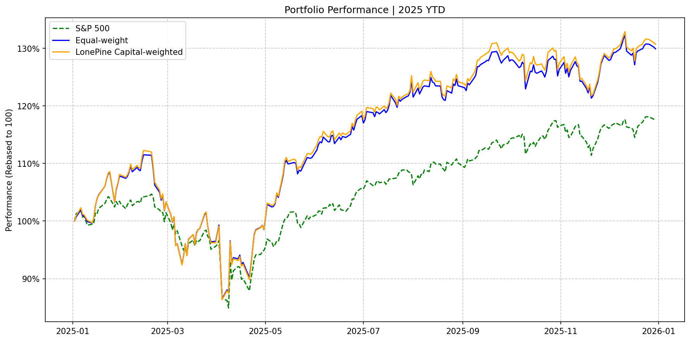
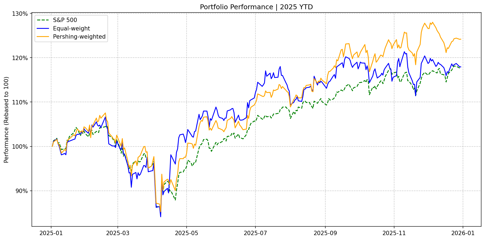

# 13F Portfolio Performance Overview (Q3)
Simulation in 20250101 - 20251231

**Methodology Notes:**
1. Each portfolio only consists of top 16 holdings. Holdings outside top 16 will be considered as cash.
2. The cash percentage(out of 13F report) will be ignored in this simulation.

## N0.5 Group

---

### ARK

  

    
  

  

    <h3>Top 10 Holdings</h3>
    

      TSLA 9.5% • 
      COIN 4.8% • 
      ROKU 4.4% • 
      PLTR 4.4% • RBLX 4.4% • HOOD 4.3% • SHOP 4.3% • CRSP 3.8% • TEM 3.5% • AMD 2.9%
    

  

## N1 Group

---

  

    <h4>WCM</h4>
    

      <h5>Top 10 Holdings</h5>
      

        SE 9.8% • 
        APP 7.3% • 
        TSM 5.7% • 
        SPOT 5.1% • ASML 3.9% • PM 3.8% • IBN 3.4% • LIN 3.4% • CPNG 3.3% • AMZN 2.9%
      

    

    

      
    

  

  
  

    <h4>Newlands</h4>
    

      <h5>Top 10 Holdings</h5>
      

        META 7.3% • 
        MSFT 5.9% • 
        GOOGL 5.6% • 
        TSM 5.5% • GEV 5.5% • AMZN 4.7% • AVGO 4.7% • CEG 4.6% • NVDA 4.5% • ETN 4.4%
      

    

    

      
    

  

## N2 Group

---

### Fundsmith

  

    
  

  

    <h3>Top 10 Holdings</h3>
    

      SYK 8.6% • 
      IDXX 8.4% • 
      GOOGL 7.7% • 
      MSFT 6.8% • V 6.7% • ADP 6.4% • WAT 6.0% • PM 5.9% • META 5.8% • MAR 5.6%
    

  

### Akre

  
  

    

      
    

    

      

        "Great businesses get better. Bad businesses disappear."
      

    

    <h3>Top 10 Holdings</h3>
    

      MA 17.9% • 
      BN 13.1% • 
      KKR 11.3% • 
      V 10.1% • MCO 10.1% • ORLY 9.3% • CSGP 7.8% • ROP 5.8% • ABNB 4.2% • FICO 3.9%
    

  

  

    
  

### Madison Asset Management

  
  

    

      
    

    

      

        "What we're really looking for are 'A' management running 'A' businesses."
      

    

    <h3>Top 10 Holdings</h3>
    

      ACGL 4.7% • 
      APH 3.3% • 
      ROST 2.7% • 
      PCAR 2.7% • CDW 2.3% • GOOG 2.3% • CPRT 2.2% • BRO 2.1% • IT 2.1% • CSL 1.9%
    

  

  

    
  

## Crossover Group

---

  

    <h4>COATUE</h4>
    

      <h5>Top 10 Holdings</h5>
      

        META 12.5% • 
        MSFT 11.2% • 
        AMZN 8.7% • 
        GOOGL 7.9% • NVDA 6.3% • TSM 5.8% • AVGO 5.2% • ASML 4.9% • ADBE 4.5% • CRM 4.2%
      

    

    

      
    

  

  
  

    <h4>Viking</h4>
    

      <h5>Top 10 Holdings</h5>
      

        PNC 4.1% • 
        JPM 4.1% • 
        SCHW 4.1% • 
        COF 4.1% • MSFT 3.3% • DIS 3.1% • TSM 2.9% • BBIO 2.7% • MCD 2.7% • FTV 2.6%
      

    

    

      
    

  

  
  

    <h4>Tiger</h4>
    

      <h5>Top 10 Holdings</h5>
      

        MSFT 10.5% • 
        SE 8.9% • 
        GOOGL 8.0% • 
        AMZN 7.5% • NVDA 6.8% • META 6.4% • TTWO 4.7% • APP 4.5% • TSM 4.0% • RDDT 3.3%
      

    

    

      
    

  

  

    <h4>LonePine</h4>
    

      <h5>Top 10 Holdings</h5>
      

        META 7.0% • 
        VST 6.7% • 
        TSM 6.2% • 
        APP 5.8% • LPLA 5.4% • PM 5.4% • BN 5.1% • CVNA 4.8% • MSFT 4.5% • AMZN 4.5%
      

    

    

      
    

  

## 非对称 Group

---

### Pershing

  

    
  

  

    <h3>Top 10 Holdings</h3>
    

      UBER 20.3% • 
      BN 19.2% • 
      GOOG 18.6% • 
      HHH 10.6% • QSR 10.0% • AMZN 8.7% • CMG 5.8% • HLT 5.4% • SEG 0.8% • HTZ 0.6%
    

  

## Biotech Group

---

### BAKER BROS. ADVISORS LP

  

    

      <h5>Top 10 Holdings</h5>
      

        ONC 21.7% • 
        INCY 18.8% • 
        MDGL 7.1% • 
        INSM 7.0% • ACAD 6.6% • SMMT 5.0% • RYTM 4.1% • RVMD 3.2% • CELC 2.8% • KYMR 2.7%
      

    

    

      
    

  

